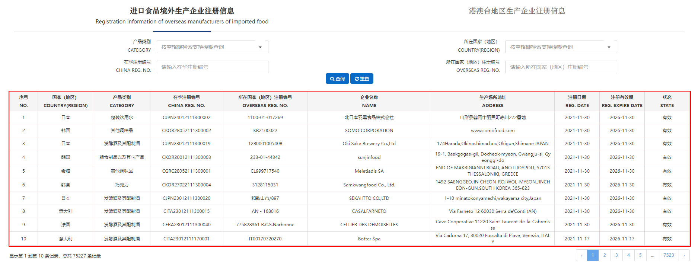

## Selenium

Selenium 是一个 Web 自动化测试工具，最初是为网站自动化测试而开发，Selenium 可以直接调用浏览器，它支持所有主流的浏览器（包括 PhantomJS 这些无界面的浏览器），可以接收指令，让浏览器自动加载页面，获取需要的数据，甚至页面截屏等。

我们知道，传统的爬虫通过模拟 HTTP 请求来爬取站点信息，由于这种方式和浏览器访问差异比较明显，很多站点都会采取一些反爬的手段，而 Selenium 是通过模拟浏览器来爬取信息，其行为和用户几乎一样，反爬策略很难区分出请求到底是来自 Selenium 还是真实用户。

不过 Selenium 爬虫不足之处在于慢，如果你对爬虫的速度没有要求，或者请求数据源传输过程加密，获取的接口难以逆向解析，可以尝试使用 Selenium 获取数据。

## 准备工作

### 安装 Selenium

推荐直接使用 pip3 安装，执行如下命令即可：

```python
pip3 install selenium
```

进入 Python 命令行交互模式，导入一下 Selenium 包，如果没有报错，则证明安装成功。

    $ python3
    >>> import selenium

### WebDriver

Selenium 的核心组件是 WebDriver ，WebDriver 可以通过调用浏览器提供的原生自动化 API 来驱动浏览器。主流浏览器都有相应的 WebDriver ，本次以 Chrome 浏览器为例，获取对应 WebDriver 及配置。

#### ChromeDriver 验证

进入 ChromeDriver 下载地址，获取对应版本 ChromeDriver
[ChromeDriver - WebDriver for Chrome](https://sites.google.com/chromium.org/driver/downloads)

> ps：注意对应版本号，chrome地址栏输入chrome://version/ 查看自己的Chrome版本


下载完成后，将 ChromeDriver 放置到 D盘或者任意地址，
之后可以运行以下脚本验证：

```python
from selenium import webdriver
from time import sleep

browser = webdriver.Chrome(executable_path="D:/chromedriver.exe")
browser.get('https://www.baidu.com')
sleep(2)
browser.close()
```

如果运行完毕之后弹出来了一个 Chrome 浏览器并加载了百度页面，2 秒之后就关闭，那就证明没问题。

[other browser webdriver](https://www.selenium.dev/documentation/webdriver/getting_started/install_drivers/)

## 实例

本次以中国海关 [进口食品境外生产企业注册信息](https://ciferquery.singlewindow.cn/) 页面为例。


### 前情提要

原本以为这个页面可以直接爬取接口，先进入页面，查看接口结构。
然后发现返回的数据进行过加密处理，无法正常显示数据。所以这个页面适合作为示例模板。

### 步骤


#### 获取页面数据

观察页面可知主体是一个 table 表格，只需要定位到对应的 table 标签即可以获取数据源。

由于 selenium 更新至 4.4 版本后`find_elements_by_xxx`接口已弃用，本次使用[新接口](https://www.selenium.dev/documentation/webdriver/elements/finders/)获取数据。

```python
from selenium.webdriver.common.by import By

fruits = driver.find_element(By.ID, "fruits")
fruit = fruits.find_elements(By.CLASS_NAME,"tomatoes")
```


通过观察页面标签节点，可以获取 class 名称未 fixed-table-body 标签下的 table, 再依次获取 tr, td 解析构建列表。

```python
def get_page_data(driver):
    """
    html_str: 入参参数, 指的是网页源码，HTML格式的
    """
    data_list = []
    try:
        """查找网页源码中的xpath，找到每一行的位置"""
        # el = driver.find_elements_by_xpath('//div[@class="fixed-table-container"]//div[@class="fixed-table-body"]/table/tbody') api已棄用
        tr_list = driver.find_elements(
            By.XPATH, '//div[@class="fixed-table-body"]/table/tbody/tr')
        for tr in tr_list:
            item = tr.find_elements(By.XPATH, './td')
            td_list = []
            """匹配對應td內容，無則為空"""
            for it in item:
                try:
                    col = it.text
                except:
                    col = ""
                td_list.append(col)
            data_list.append(td_list)
            # print('data_list..', data_list)
    except Exception as e:
        print(e)
    return data_list

```

#### 控制点击下一页

`ActionChains`  类记录了键盘、鼠标、笔等页面方法，可以帮助你更好的操作浏览器，例如下面的行为：

获取下一页的标签，并触发[点击事件](https://www.selenium.dev/documentation/webdriver/actions_api/mouse/)

```python
clickable = driver.find_element(
            By.XPATH, '//li[@class="page-item page-next"]/a')
ActionChains(driver).click(clickable).perform()
```

需要注意的是点击下一页后，有一个数据请求的过程，这时候应该 [隐式等待](https://www.selenium.dev/documentation/webdriver/waits/) 几秒再爬取数据。

### 完整示例

```python
import re
import time

import openpyxl
from selenium import webdriver
from selenium.webdriver.common.by import By
from selenium.webdriver import ActionChains


def get_page_data(driver):
    data_list = []
    try:
        """查找网页源码中的xpath，找到每一行的位置"""
        # el = driver.find_elements_by_xpath('//div[@class="fixed-table-container"]//div[@class="fixed-table-body"]/table/tbody') api已棄用
        tr_list = driver.find_elements(
            By.XPATH, '//div[@class="fixed-table-body"]/table/tbody/tr')
        for tr in tr_list:
            item = tr.find_elements(By.XPATH, './td')
            td_list = []
            """匹配對應td內容，無則為空"""
            for it in item:
                try:
                    col = it.text
                except:
                    col = ""
                td_list.append(col)
            data_list.append(td_list)
            # print('data_list..', data_list)
    except Exception as e:
        print(e)
    return data_list

def write_excel(file_name, write_list):
    """
    将每一行的数据汇总的数组，进行遍历，依次写到excel中
    file_name: 入参参数, 指的是写入excel的名字
    write_list: 入参参数, 指的是写入excel的每一行汇总的数组
    """
    full_excel = openpyxl.Workbook()
    full_sheet = full_excel.active
    for i in range(0, len(write_list)):
        full_sheet.append(write_list[i])
    full_excel.save(file_name)

if __name__ == '__main__':
    url = "https://ciferquery.singlewindow.cn/"
    options = webdriver.ChromeOptions()
    options.add_argument('--proxy-server=http://127.0.0.1:7890')
    driver = webdriver.Chrome(executable_path="D:/chromedriver.exe",
                              chrome_options=options)
    driver.implicitly_wait(3)
    driver.get(url)

    every_page_result_list = []  # 空数组接受每一页的所有数据行汇总数据
    """循环每一页获取数据"""
    pages = 10
    for index in range(1, pages + 1):
        every_page_result_list = every_page_result_list + get_page_data(driver)
		# 获取下一页按钮 						
        clickable = driver.find_element(
            By.XPATH, '//li[@class="page-item page-next"]/a')
        ActionChains(driver).click(clickable).perform()
        driver.implicitly_wait(1)
        print("获取第{0}页成功...".format(index))
    """这里是文件excel写入路径，你可以指定任意存在或者不存在的文件"""
    write_excel(r"D:\test.xlsx", every_page_result_list)

    time.sleep(3)
    driver.quit()
```
