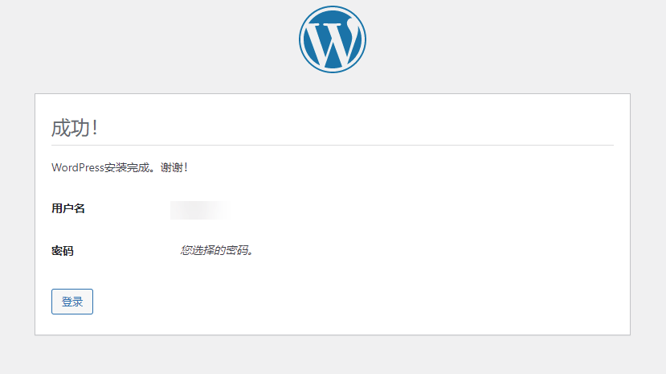
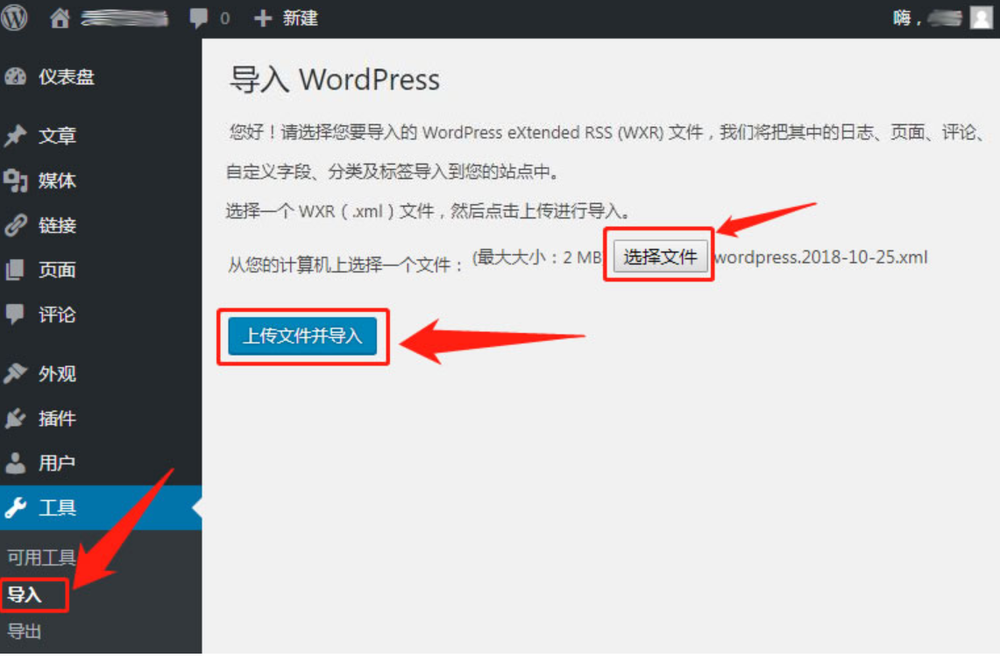

### 系统环境

*   Ubuntu版本：Ubuntu 20.04
*   PHP：7.4
*   Nginx & MySQL

### 安装Nginx

1.  运行以下命令，更新Ubuntu系统内的软件包

```sh
sudo apt-get update
```

2.  运行以下命令，安装Nginx

```sh
sudo apt-get -y install nginx
```

上述命令执行完毕后，浏览器访问你的服务器公网ip；若显示以下内容则证明安装成功：


### 安装PHP及其扩展

执行以下命令安装PHP及其扩展：

```sh
sudo apt-get install php-fpm php-mysql php-gd php-curl php-dom php-mbstring php-imagick php-zip
```

### 安装MySQL

1.  执行下面的命令安装 MySQL：

```sh
sudo apt-get install mysql-server
```

2.  安装完成后，接着执行：

```sh
mysql_secure_installation
```

如果显示：

```sh
Securing the MySQL server deployment.

Enter password for user root:
```

如果在安装的时候设置过 `root`的密码，则输入密码后再按 `Enter`键，否则直接按 `Enter`键跳过即可。

3.  接着安装程序将会询问是否需要设置验证密码组件：

```sh
VALIDATE PASSWORD COMPONENT can be used to test passwords
and improve security. It checks the strength of password
and allows the users to set only those passwords which are
secure enough. Would you like to setup VALIDATE PASSWORD component?

Press y|Y for Yes, any other key for No:
```

4.  输入 `y` 然后按下 `Enter`；随后需要设置密码强度校验政策。这里根据个人的密码强度选择输入对应数字后按回车键即可。随后根据提示设置好root密码。

```sh
There are three levels of password validation policy:

LOW    Length >= 8
MEDIUM Length >= 8, numeric, mixed case, and special characters
STRONG Length >= 8, numeric, mixed case, special characters and dictionary                  file

Please enter 0 = LOW, 1 = MEDIUM and 2 = STRONG:
```

5.  接下来，输入 `y` 然后按下 `Enter`，删除匿名用户：

```sh
By default, a MySQL installation has an anonymous user,
allowing anyone to log into MySQL without having to have
a user account created for them. This is intended only for
testing, and to make the installation go a bit smoother.
You should remove them before moving into a production
environment.

Remove anonymous users? (Press y|Y for Yes, any other key for No) :
```

6.  继续输入 `y` 然后按下 `Enter`，禁止 `root` 远程登录：

```sh
Normally, root should only be allowed to connect from
'localhost'. This ensures that someone cannot guess at
the root password from the network.

Disallow root login remotely? (Press y|Y for Yes, any other key for No) :
```

7.  再次输入 `y` 然后按下 `Enter`，删除测试数据库：

```sh
By default, MySQL comes with a database named 'test' that
anyone can access. This is also intended only for testing,
and should be removed before moving into a production
environment.


Remove test database and access to it? (Press y|Y for Yes, any other key for No) :
```

8.  输入 y 然后按下 Enter，立即重新加载权限：

```sh
Reloading the privilege tables will ensure that all changes
made so far will take effect immediately.

Reload privilege tables now? (Press y|Y for Yes, any other key for No) :
```

进行到这一步，数据库初始化设置完成。

9.  接下来，输入以下命令进入数据库：

```sh
mysql -uroot -p
```

10. 输入前面设置的 `root` 密码，然后按下 `Enter`。如果出现如下则证明成功进入数据库：

```sh
Welcome to the MySQL monitor.  Commands end with ; or \g.
Your MySQL connection id is 10
Server version: 8.0.23-0ubuntu0.20.04.1 (Ubuntu)

Copyright (c) 2000, 2021, Oracle and/or its affiliates.

Oracle is a registered trademark of Oracle Corporation and/or its
affiliates. Other names may be trademarks of their respective
owners.

Type 'help;' or '\h' for help. Type '\c' to clear the current input statement.

mysql>
```

11. 接下来，输入下面的命令创建一个名为wordpress的数据库：

```sql
CREATE DATABASE IF NOT EXISTS wordpress DEFAULT CHARACTER SET = utf8mb4 DEFAULT COLLATE = utf8mb4_general_ci;
```

看到如下提示，则说明数据库创建成功：

```sql
Query OK, 1 row affected (0.12 sec)
```

12. 然后输入下面的命令创建一个数据库用户 `wordpress` 用来操作上面创建的 `wordpress` 数据库。你需要修改命令中的 `{password}` 为你自己的密码。

```sql
CREATE USER 'wordpress'@'localhost' IDENTIFIED BY '{password}';
```

13. 接下来，执行下面这条命令，授予用户 `wordpress` 拥有数据库 `wordpress` 的所有权限：

```sql
GRANT ALL PRIVILEGES ON wordpress.* TO 'wordpress'@'localhost' WITH GRANT OPTION;
```

14. 随后输入下面的命令刷新权限：

```sh
FULSH PRIVILEGES
```

15. 最后，退出数据库：

```sql
exit
```

### 下载WordPress安装程序

1.  通过以下命令下载最新版的WordPress中文版安装程序到路径 **/var/www** 中，下载文件命名为 **wordpress.tar.gz**:

```sh
curl https://cn.wordpress.org/latest-zh_CN.tar.gz -o /var/www/wordpress.tar.gz
```

2.  进入 **/var/www** 文件夹：

3.  解压前面下载的 **wordpress.tar.gz** 到当前文件夹中：

```sh
tar -zxvf wordpress.tar.gz
```

4.  修改文件夹用户组权限：

```sh
chown -R www-data:www-data /var/www/wordpress
```

### 修改Nginx配置文件

接下来，需要修改Nginx配置文件。

1.  进入配置文件目录

```sh
cd /etc/nginx/sites-available/
```

2.  接着使用Vim编辑器打开配置文件进行修改：

```sh
vim default
```

注：如果提示 `bash: vi: command not found.` 则先通过下面的命令安装Vim，安装完成后再执行前面的命令修改配置。

3.  打开配置文件后，按下键盘的**i**键进入编辑状态，将配置修改成如下，修改好后按**Esc**退出编辑状态，最后按下\*\*:wq\*\*保存修改并关闭配置文件。

```sh
server {
  listen 80;
  listen \[::\]:80;
  root /var/www/wordpress;
  index index.php;
  server_name {you-domain};
  location / {
    try_files $uri $uri/ =404;
  }
  location ~ \\.php$ {
    include snippets/fastcgi-php.conf;
    fastcgi_pass unix:/var/run/php/php7.4-fpm.sock;
  }
}
```

注：如果没有使用域名，则无需修改配置文件内的 `server_name` 字段。其中配置文件内 fastcgi\_pass 这一项中的 php7.4-fpm.sock 对应的是php-fpm版本。

本文安装的是 PHP 7.4，在修改配置时请记得替换成你们安装的版本。如果不确定自己安装的PHP是什么版本，**可通过 `php -v` 命令查看服务器安装的对应PHP版本**。

3.  测试配置是否正确：

```sh
nginx -t
```

如果出现如下信息则代表配置成功：

```sh
nginx: the configuration file /etc/nginx/nginx.conf syntax is ok
nginx: configuration file /etc/nginx/nginx.conf test is successful
```

4.  重载配置以生效：

```sh
sudo systemctl reload nginx
```

### 浏览器引导安装WordPress

以上所有步骤执行完毕后，回到浏览器访问服务器公网ip，将会看到WordPress欢迎页面。点击“下方现在就开始！”按钮继续。


在下一个界面中，将用户名修改为wordpress，密码一栏填入刚才设置的数据库密码，然后点击提交即可。

随后，你将会看到WordPress成功安装的页面：



### 导入导出网站数据

#### 导入数据

访问后台-工具-导入


上传data文件并导入：点击"运行导入器"，进入 WordPress 导入界面 ——》选择导出的xml文件 ——》上传文件并导入


#### 导出数据

访问后台 —工具 —导出—选择“所有内容”，下载导出的文件。你将得到一个 .XML 文件，这个XML文件包含全部文章、页面、评论、自定义栏目、分类目录和标签。


注意：

1.  该方法导出的文件，不包含网站的设置、插件和主题信息、源文件的，因此比较干净。如果你要备份所有的数据信息，可以使用WordPress数据库定时备份插件：WordPress Database Backup 或者通过 phpMyAdmin 导出数据库的方法，此外，你还需要使用 FTP 下载转移网站的主题、插件、图片附件等，这样，才是最完整的备份。

2.  如果在导出时出现错误，可能是由于主题或插件冲突造成的，建议你切换默认主题和禁用所有插件。

3.  如果你的文章很多，导出的xml文件超过导入的大小限制，可以使用 wordpress xml文件分割器 。

参考：

*   [Ubuntu系统lnmp框架搭建WordPress](https://www.cnblogs.com/WeQi-Blog/p/15904145.html)
*   [Ubuntu Server 20.04 安装WordPress](https://zhuanlan.zhihu.com/p/445191504)
