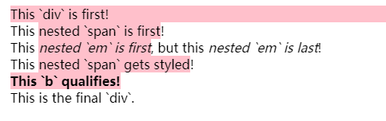

### :checked

**:checked** CSS 伪类选择器表示任何处于选中状态的radio(<input type="radio">), checkbox (<input type="checkbox">) 或 ("select") 元素中的option HTML 元素 ("option")。

用户通过勾选/选中元素或取消勾选/取消选中，来改变该元素的 **:checked** 状态。

```html
<div>
  <input type="radio" name="my-input" id="yes">
  <label for="yes">Yes</label>

  <input type="radio" name="my-input" id="no">
  <label for="no">No</label>
</div>

<div>
  <input type="checkbox" name="my-checkbox" id="opt-in">
  <label for="opt-in">Check me!</label>
</div>

<select name="my-select" id="fruit">
  <option value="opt1">Apples</option>
  <option value="opt2">Grapes</option>
  <option value="opt3">Pears</option>
</select>
```

### :dir()

**:dir()** 伪类匹配特定文字书写方向的元素。在 HTML 中，文字方向由dir属性决定。其他的文档类型可能有其他定义文字方向的方法。

值得注意的是用 CSS 伪类 :dir() 并不等于使用 \[dir=…] 属性选择器。后者匹配 dir 的值且不会匹配到未定义此属性的元素，即使该元素继承了父元素的属性；类似的， \[dir=rtl] 或 \[dir=ltr] 不会匹配到 dir 属性的值为 auto 的元素。而 :dir()会匹配经过客户端计算后的属性，不管是继承的 dir 值还是 dir 值为 auto 的。

```html
<div dir="rtl">
  <span>test1</span>
  <div dir="ltr">test2
    <div dir="auto">עִבְרִית</div>
  </div>
</div>
```

:dir(rtl) 会匹配最外层的 div，内容为test1 的 span，和有希伯来字符的 div。:dir(ltr) 会匹配到内容为test2 的 div.

### :first-child

**:first-child** CSS pseudo-class 表示在一组兄弟元素中的第一个元素。

```html
<div>
  <p>This text is selected!</p>
  <p>This text isn't selected.</p>
</div>

<div>
  <h2>This text isn't selected: it's not a `p`.</h2>
  <p>This text isn't selected.</p>
</div>

p:first-child {
  color: lime;
  background-color: black;
  padding: 5px;
}
```


### :first-of-type

**:first-of-type** 表示一组兄弟元素中其类型的第一个元素。选择在父元素中第一个出现的`<p>`，而不管其在兄弟内的位置如何。

```html
<template>
	<article>
	  <div>This `div` is first!</div>
	  <div>This <span>nested `span` is first</span>!</div>
	  <div>This <em>nested `em` is first</em>, but this <em>nested `em` is last</em>!</div>
	  <div>This <span>nested `span` gets styled</span>!</div>
	  <b>This `b` qualifies!</b>
	  <div>This is the final `div`.</div>
	</article>
</template>

article :first-of-type {
  background-color: pink;
}
```


