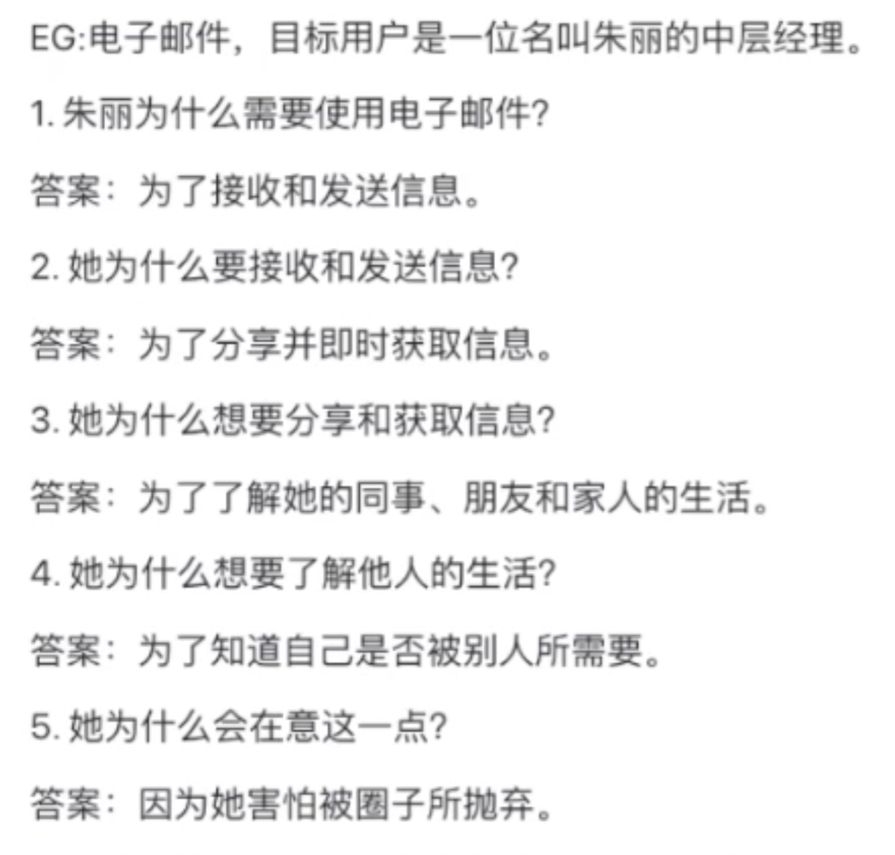

### 产品是最好的营销：占领用户心智

苹果的“白雪”设计风格奠定这，青蛙设计的艾斯林格：形式追随情绪价值（而不是追随功能）
例如 苹果发布的AR眼镜，作为用户的我，即使知道贵，不过还是想买，能挑动用户的情绪才是终极形态

真实的用户就是这么肤浅：我看到了，心动了，有钱想买就买了

就像 苹果产能不够，铺货渠道不够多，然鹅用户愿意等
一个95分的优点比10个70分的长处要更加吸引人，还是要抓住用户的核心需求

消费升级：个人愿意付出更高的成本购买与自我价值相匹配的产品。购买即是一个身份的认同，购买也是一种意见表达。（花钱买爷开心）

### 让你的产品成为用户的习惯

习惯：就是一种“在情境暗示下产生的**无意识**行为”，是我们几乎不假思索就做出的举动。
培养用户习惯的公司不依赖于费用高昂的营销策划，而是将产品设计和用户的行为习惯和情感状态紧密相连。

### 习惯的力量：让你的产品从维生素变成止痛药

营销过程中把痒点（维生素）变成解决痛点（止痛药）一样的变化

用户终身价值：一个用户在其有生之年忠实使用某个产品的过程中为其付出的投资总额。当用户对某个产品产生依赖的时候，使用时间会延长，使用频率会增加，最终哦那个胡终身价值也会提高。

一个品牌的衡量标准就是定价权，你能不能涨价，涨价也不会影响用户流失
品牌的力量就是用户对产品的依赖，价格敏感的用户也会选择

人都有劣根性，形成依赖后再改会很难
新产品的胜出=新功能 >>（旧功能）-习惯

习惯=频率+感知价值

### 上瘾模型

上瘾模型（the Hook Model):触发-行动-多变的奖赏-投入
Hook up:吸引用户就像谈恋爱，勾搭对眼就行
跪舔用户是没有前途的
低价不是壁垒，低成本才是，名创优品9.9的雨伞包赚50%的原因在于下单量级（10w vs 1000w)不同

#### 触发：行为召唤

外部触发：通过发起行动召唤来暗示用户，这是打造习惯养成类技术的第一步。就像 路边看到 M 的招牌，召唤人进去买汉堡

内部触发：当某个产品和你的思想、情感或者是原本已经有的常规活动发送密切关联，你看不到，摸不着，但他自动出现在你的脑袋里。

内部触发的阀门就是**情绪**

恐惧感才是她最大的内部触发，你设计的产品需要抓住这一点去做指导。

#### 行动：人们在期待奖赏时的直接反应

一个行为的前提条件是 动作要简单，复杂程度越低，越易于重复

行动要素：充分的动机，完成行为的能力，促使人们付诸新的的触发动作

核心动机：

1.  追求快乐，逃避痛苦
2.  追求希望，逃避恐惧
3.  追求认同，逃避排斥

厌恶损失：逃避的要素>> 追求的要素

#### 能力：能不能做到-简单才能做到

影响任务难易度的要素：

1.  时间
2.  金钱
3.  体力
4.  脑力
5.  社会偏差：他人的接受程度
6.  非常规性：和其他常规活动的匹配程度和矛盾程度

动机和能力的优先级：先解决能力问题，降低用户的使用门槛
稀缺效应，环境效应，锚定效应，赠券效应

#### 多变的奖励机制：随机的激发使用欲

斯金纳鸽子实验：随机性让压动操纵杆的次数明显增加

驱使我们行动的不是奖励本身，而是渴望奖励时产生的那份迫切需要。

社交酬赏：来自他人的认同
猎物酬赏：资源，金钱和信息（老虎机，抖音）
自我酬赏：操控感，成就感，胜任感（游戏勋章）

> 当给的钱不够多的时候，不要给钱作为奖励，寻求其他价值奖赏

#### 投入：用户付出越多，粘性越高

宜家效应：付出过劳动的人给自己的作品会附加更多的价值。
要警惕这一点，市场不会看这个。

行为前后一致效应：在用户答应一个小条件后，得寸进尺的提出更大的条件，用户维护面子有概率会认
答应放小的（50公分）广告牌-得寸进尺的放置3米的广告牌
