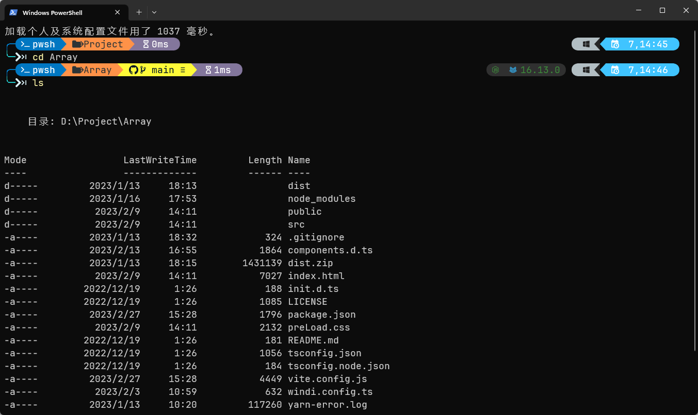
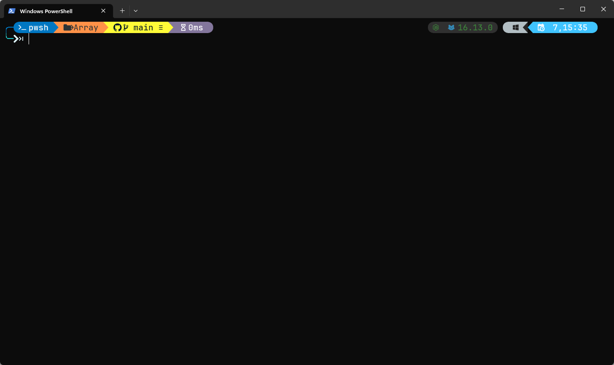

因为 MacBook 性能有些跟不上的关系，最近新组了台式，装完软件后发现 Windows 的 cmd 是真的丑，遂想改造一下。

在体验完 Cmder 和 Hyper 恼人的 bug 后，发现系统自带的  `Windows Terminal`  挺好用的，而且多了一些有意思的功能：

*   支持 WSL2，SSH，Powershell，cmd 和其他命令行
*   多个选项卡和拆分窗格
*   搜索框
*   自定义键绑定
*   GPU加速文字渲染
*   美观的新字体Cascadia Code
*   资源使用率低（每个选项卡通常10MB）
*   它是开源的！

PS:
window11 系统默认会自动安装 Windows Terminal 的， 如果是 windows 10 的系统需要先 下载 [windows-terminal](https://apps.microsoft.com/store/detail/windows-terminal/9N0DX20HK701?hl=zh-cn\&gl=cn)

当然光有终端不够，还需要加一点点 Magic。下面我们使用 Oh My Posh 美化一下界面。


## 安装 [Oh My Posh](https://ohmyposh.dev/)

win+X然后再按A，以管理员模式打开powershell，输入以下指令安装oh-my-posh：

```bash
winget install JanDeDobbeleer.OhMyPosh -s winget
```

*   PS：不要再使用有些教程中的 [Install-Module](https://ohmyposh.dev/docs/migrating) 命令来安装了，官网换了安装方式。

## PowerShell 配置文件

PowerShell 配置文件是在 PowerShell 启动时运行的脚本，可以将配置文件用作登录脚本来自定义环境， 可以添加命令、别名、函数、变量、管理单元、模块和 PowerShell 驱动器， 还可以将其他特定于会话的元素添加到您的配置文件中，以便在每个会话中都可以使用它们，而无需导入或重新创建它们。

可以使用以下命令 查看当前是否存在 PowerShell 配置文件：

```bash
Test-Path $Profile
```

如果没有 **Microsoft.PowerShell\_profile.ps1** 文件，使用命令创建一个配置文件

```bash
New-Item -Path $PROFILE -Type File -Force
```

在创建好 PowerShell 配置文件文件后查看下 当前的 PowerShell 执行策略:

```bash
get-ExecutionPolicy
```

将执行策略设置为 `RemoteSigned`，执行命令是：

```bash
set-ExecutionPolicy RemoteSigned
```

如果不设置可能会报错 `无法加载配置文件`

### 快速打开配置文件

可以使用以下命令打开配置文件：

```bash
code $Profile
```

## Oh My Posh 主题配置

*   [定制化配置](https://ohmyposh.dev/docs/installation/customize)

*   [Oh My Posh 主题](https://ohmyposh.dev/docs/themes)

在上面打开的配置文件中输入：

```bash
oh-my-posh init pwsh --config "$env:POSH_THEMES_PATH/atomic.omp.json" | Invoke-Expression
```

最后返回终端，输入 **. $PROFILE** 保存配置即可生效。

## 主题文本字体设置


如果步骤没错会出现上面的效果，文本变成乱码了。这是因为 Oh My Posh是为使用 [Nerd Fonts](https://www.nerdfonts.com/) 设计的。Nerd Fonts是流行的字体，经过修补后包括图标。这时候需要设置一下字体。

```bash
oh-my-posh font install
```

选择一种字体安装即可。这里推荐 **JetBrainsMono Nerd Font**。

在安装了 Nerd Font 后，需要配置Windows终端来使用它。

## 设置 Windows Terminal 环境配置

首先，我们进入 Windows Terminal 的设置文件。在 Windows Terminal 的下拉菜单中，选择 Settings（或使用快捷键 Ctrl + ,）再左下角选择 打开JSON文件，即可打开配置文件。（或使用默认快捷键：CTRL + SHIFT + ，）


Windows Terminal 的配置文件是一个 JSON 格式的文件，我们会在其中定义全部 Windows Terminal 的属性。简单来讲，这个配置文件包含了如下的几个部分：


在你的settings.json文件中，在 profiles中的defaults属性下添加font.face属性。

```json
{
    "profiles":
    {
        "defaults":
        {
            "font":
            {
                "face": "JetBrainsMono Nerd Font",
                "size": 14
            }
        }
    }
}
```

保存后页面就恢复正常了。


## 插件及问题

### gsudo

gsudo 能在 Windows 上提供类似于 Linux 上的 sudo 功能，
让我们使用命令提升至系统管理员权限。

安装命令：

```bash
winget install gsudo
```

使用方法和 Linux 一样，输入 **sudo** 后会弹出 是否开启管理员权限的弹窗。

### posh-git

[posh-git](https://github.com/dahlbyk/posh-git) 可以使用 Git 的命令。
使用 PowerShell  安装：

```bash
PowerShellGet\Install-Module posh-git -Scope CurrentUser -Force
Add-PoshGitToProfile
```

*   PS：Windows  PowerShell 5.x or PowerShell >= v6 (pwsh)

### 如何去除 Window PowerShell 版权所有提示

如何去除 Window PowerShell 版权所有提示，在上面的 Microsoft.PowerShell\_profile.ps1 最前面加上 **clear**
