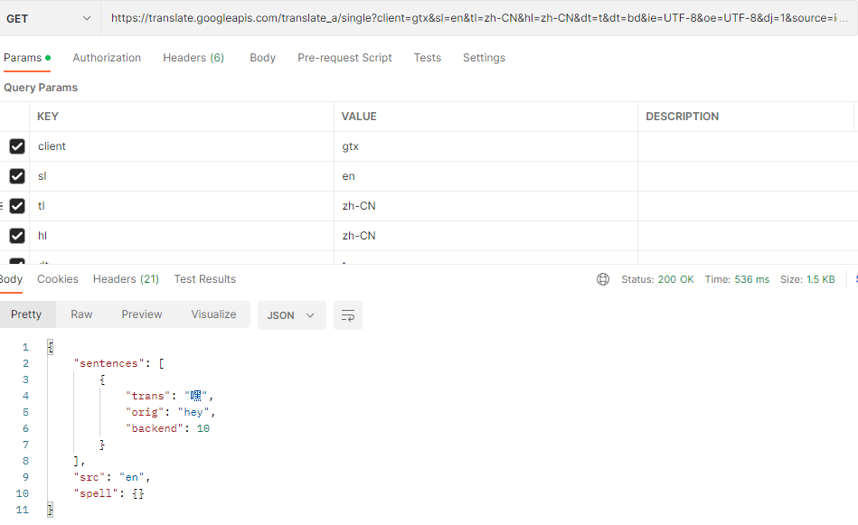

## Google

### free

```ts
const apiRoot = 'https://translate.googleapis.com'
const url = `${apiRoot}/translate_a/single?client=gtx&sl=${from}&tl=${to}&hl=zh-CN&dt=t&dt=bd&ie=UTF-8&oe=UTF-8&dj=1&source=icon&q=${encodeURI(text)}`

const { data } = await axios({ method: 'GET', url })
```

### Api

```ts
const apiRoot = 'https://translation.googleapis.com'
let {
      from = 'auto',
      to = 'auto',
    }

const slugs = {
      from: from === 'auto' || !from ? '' : `&source=${from}`,
      to: to === 'auto' || !to ? '' : `&target=${to}`,
    }

const url = `${this.apiRoot}/language/translate/v2?key=${key}&q=${encodeURI(text)}${slugs.from}${slugs.to}&alt=json&format=text`

const { data } = await axios({ method: 'GET', url })
```



## DeepL

```ts
const url = https://api-free.deepl.com/v2/translate
const headers = {
	Content-Type: 'application/x-www-form-urlencoded',
	Authorization: `DeepL-Auth-Key ${key}`
}
const body = {
	text: '你好',
	source_lang: 'ZH',
	target_lang: 'EN'
}
const { data } = await axios({ method: 'POST', url, headers, body })
```

PS: Content-Type: application/json 也支持


