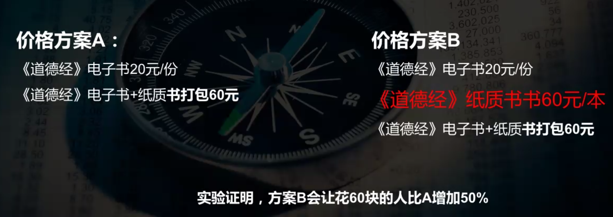

## 价格是盈利的关键

> 全世界只有8%的公司会系统性考虑定价

定价背后的用户筛选和价值塑造

定价的大坑：

*   基于成本定价
*   瞄准竞争对手定价
*   为了追求销量定低价

### 基于成本定价为什么流行？

1.  使用最简单（算比例，加成本翻倍率）
2.  看起来最公平（人倾向于追求‘公平’）
3.  财务最“正确”(财务的政治正确)

> 茅台成本几十块，定价2000多

问题：

*   用户根本不知乎你的成本
    用户大概率不知道你的成本，而且我们作为用户也不在乎成本，而是在于这个产品是不是用的爽，心情好不好
*   成本随着销量改变，根本无法精确算清楚
    像是李佳奇不出名的时候，坑位费基本没有，现在几百万。。
*   最要命的：成本定价以自我为中心，而不是以市场为中心，价格取决于用户买不买帐

> “薄利多销”只是个符合直觉，但其实很过时的观念了。

定价不等于成本+利润
成本只能告诉我们最低价格，而不是最合适的价格

#### 苹果Vison Pro的定价逻辑是什么？

25000/台
成本较贵：市场普通液晶显示器，苹果非通用微缩OLED-300美金
堆料：市场1芯片4摄像头1传感器，苹果2芯片12摄像头5传感器
目标是奔着第一去的，基本不计成本，而是和商业模式、战略强相关

调查了一下苹果头显的制作成本，再加上物流、仓储、货损、退换货、不良率、代理商等，3500美金的价格真的可能没有利润！
都说苹果产品毛利太高，而这个项目整体真的很不“苹果”：价格不“苹果”，内在设计不“苹果”，外接的那一块1万mAh的大电池更不“苹果”。

我看到的是，它开辟了这个全新的赛道、没有竞争对手，为了让更多的人使用、且第一时间习惯苹果、提高未来竞争对手“迁移成本”的一系列巨大的调整，因市场而非自我的调整。
我相信这种巨大的策略调整和前期没有利润的定价，从长期时间跨度上来讲，ROI一定是非常非常高的。

#### 特斯拉的定价：

第一代 富人的玩具，环保的政治正确（说给用户的是产能不够，够环保）-人设及品牌故事
第二代 富裕中产的面子（说给用户的是技术过关了，谋福利）-中产人的体面，因为美国富人都买
第三代 普通中产的性价比（电车的故事讲完了，市场稳定）

> 小公司是没有资格烧钱降价走量的

### 瞄准竞争对手定价为什么流行？

问题：

1.  简单，不需要深度调研
2.  貌似安全，跟着竞品随大流

错误：

1.  消极被动，被竞品制约
2.  容易陷入恶性竞争，大家都没钱赚

小公司倾向于比竞品定价更低一点，而不敢定高价，然后竞品又会降价陪你玩

*   你只看到对手的价格，看不到背后的战略和能力
    你完全不知道对手的产品核心是什么，直接抄价格是不行的

你以为的随大流是最安全的，没有差异化才最危险

*   为了追求销量定低价
    把以卖的多（收入、销量、市场份额）为目标，而不是把赚的多（盈利）当作目标

> 营收做到1亿，年底的利润可能才几百万（1%净利润）

现金流不属于利润，不属于你个人能自由支配的钱，它可能要发工资，付工程款，只能说是救命的

云南白药刚开始6元根本卖不动，后面提到48卖爆了。。

### 为什么“定低价”成为习惯？

1.  “薄利多销”意识根深蒂固
2.  对销量敏感，对利润不敏感

> 如果市场份额下降10%，许多人会受到严厉惩罚；但利润下降20%，没有人会在乎

规模带来利润的时代已经过去了
*宝洁*的蛮荒时代，当时我们选择项只有海飞丝一类的大众品牌
现在选择项有很多，我们的思维还在上个时代

#### 网红新消费独角兽为什么死的快？

网红品都是火得快死得更快，因为不像互联网产品具有的特性
互联网的特有属性：用户的时间成本和粘性高，有壁垒
消费品这个品类下，用户的忠诚度不高，那个有折扣用户往哪走

> 牺牲原本能赚到的利润去换取销量，今天毫无意义，因为用户会跟着折扣优惠跑

想想飞书和腾讯会议这些早期免费，现在都开始收费了，因为用户在这上面有沉淀，迁移成本足够高，用户粘性高

规模化等于规模化利润，而不是规模化营收

## 定价：利润的终极杠杆

驱使利润的要素：
价格 > 销量 & 成本

沃顿商学院的数据：
成本降低1%，盈利能力2.45%
销售额提升1%，盈利能力提升3.28%
**价格提升1%，盈利能力提升10.29%**

因为营收和成本更容易量化和计算的事情，管理者往往关注营收多余利润

不要过度控制成本，向价格去要利润，而不是从成本去省利润；
因为成本压下去，质量可能下降，用户大概率离开

薄利多销是小农时代的思维，大量的赛道是红海，对市场占有率的极致追求正是导致很多企业低利润/无利润的主要原因

**传统**市场逻辑：
赢得市场占有率，利润随之而来
**现实**市场逻辑：
客户真正想要的价值是什么
我们需要做到的是如何把利润做高，利润起来的前提下才是如何赢得市场占有率

以产品为中心、追求市场占有率的旧世界已经变成了 **客户**和市场需求

## 定价技巧

我们都是为了情绪价值买单

1.  愚蠢诱饵定价
    用户A和B之间很难做出决策时，给用户一个看起来很愚蠢的诱饵参照方案，会直接影响用户的选择
    

价格锚定效应：中间选项是多余的，只是为了做对照

2.  捆绑定价
    捆绑定价，以一个综合价格提供两个以上的产品和服务
    **麦当劳全家桶**
    好处：
    1.） 掩饰个别价格
    2.）隐藏价格上涨
    3.）降低心里价格评估过程逃避竞争
    4.）超值幻觉的体验

核心：打包产品要有强相关性，保证用户迫切需要A也不排斥B

3.  锚定定价
    给你想卖的一个定价
    爱马仕店里“永远不卖”的200w手表
    菜单上贵得离谱的菜，只是给个对比，让你点平价的
    实际价格旁边一直有的“原价”

4.  中间偏好定价
    对于不够熟悉的东西，人们喜欢中间价位的
    例如：
    红酒：98/杯；68/杯；48/杯（70%的人会选68）
    红酒：128；98；68（68%的人会选98）
    在信息不对称的时候，我们会选择中间价位的，中间==安全

把你最想卖的产品放到“中间价位”，分别提供更贵更低的对比

### 降价的第一原则：不要轻易降价

危害：
如果你一直给用户的印象都是高品价优的，你降价会让你的形象变廉价，影响复购
如果经常降价，客户会等你降价而不是马上购买

### 什么时候适合降价？

当产品进入衰退期，可以在短期内考虑降价以抵消需求下降带来的影响
最重要的是研发推出符合市场需求的新产品，获取更高利润，同时让衰退的产品下市

瑞幸：“奶茶化咖啡”的心智开创
它摆脱了规模化扩张的陷阱，而是开拓“奶茶”市场
永远不要陷入价格比拼，创造高价值，获取高利润才是重点

## 重新理解定价

定价：通过价格实现利益最大化的方法论

你自己认知你的产品是什么位置

越低端，越注重**功能**
越高端，越注重**情感**

### 定生态位

生态位没有高下，只有匹配度
像一个扣子，可能做到几个亿的利润（低端的产品，主要考虑供应链和成本）
当你选择一个生态位，其实已经初步选定了一个价格区间

### 定模式

找到最大的利润点：销量和价格的平衡点

用户问卷测价格没有用，需要真实的价格实验
价格实验原则：

1.  付款才算
2.  从高到低测试，测到满意值（利润）可以停
3.  不要过度实验：千元产品测到百位就好
